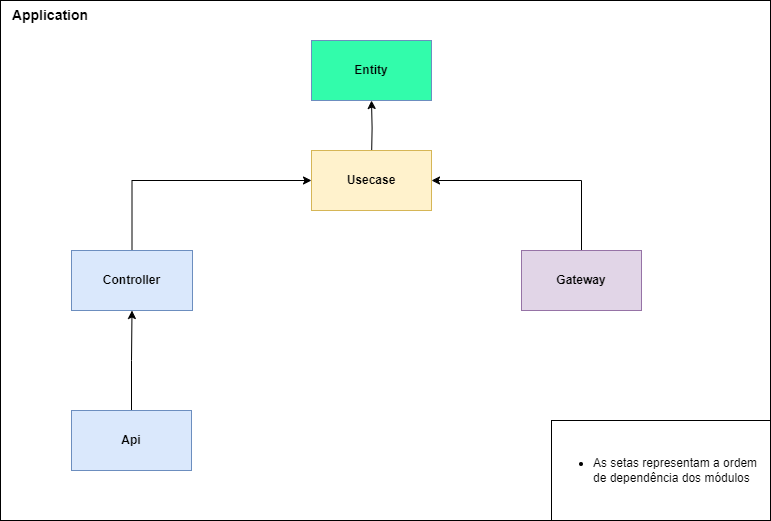

# Tech Challenge FIAP - Burger
Projeto da pós graduação da FIAP de Arquitetura de Software

## Design / Módulos



## Documentação
* [Wiki - Notion](https://www.notion.so/9dfe9780ad5f4d9587adc565f54bb70f?v=f2ef9c679bcf4ad1b857479c1f317c25)
* [Event Storm - MIRO](https://miro.com/app/board/uXjVMK9Fze8=/?share_link_id=624130302810)

## Dependências
* [IntelliJ IDEA (Opcional)](https://www.jetbrains.com/idea/download/#section=windows)
* [Java JDK 19](https://www.oracle.com/java/technologies/javase/jdk19-archive-downloads.html)
* [Spring Boot 3.1.0](https://spring.io/projects/spring-boot)
* [Gradle 7.6.1](https://gradle.org/)
* [Flyway](https://flywaydb.org/)
* [Jacoco](https://www.jacoco.org/jacoco/trunk/index.html)


## Endpoints

Para visualizar os endpoints disponíveis na aplicação basta acessar o swagger em [http://localhost:8080/swagger](http://localhost:8080/swagger)


## Desenvolvimento
### Executando somente dependências

Para executar somente dependências externas (Mysql, RabbitMQ, etc) da aplicação para o ambiente de desevolvimento local basta executar o comando abaixo:

```bash
docker-compose -f docker-compose-without-application.yml up --build
```

A aplicação será exposta na porta 8080.

### Versionamento de libs gradle

Estamos usando um arquivo [.toml para versionar](https://docs.gradle.org/current/userguide/platforms.html#sub::toml-dependencies-format) as libs utilizadas pelo gradle. Para saber mais acesse o arquivo [libs.versions.toml](gradle/libs.versions.toml).

### Cobertura de teste

Foi configurado juntamente com o plugin do jacoco para o gradle a task com nome `codeCoverageReport` que irá disparar a execução de testes da aplicação e gerar o relatório hml. Para isso execute o comando:
```bash
./gradlew codeCoverageReport 
```
Para acessar esse relatório gerado acesse o caminho `build/reports/jacoco/codeCoverageReport/html/index.hml` e abre no navegador.


## Executando aplicação

Execute o comando abaixo para iniciar os containers com a base de dados e executar a aplicação localmente.

```bash
docker-compose up --build
```

## Executando aplicação com kubernetes

Os arquivos de configuração do kubernetes estão presentes na pasta [config/kubernetes](config/kubernetes/).

### Kubernetes Local
Para configurar a aplicação no kubernetes local execute as etapas abaixo:

1 - Iniciar base de dados através do comando

``` bash
docker-compose -f docker-compose-without-application.yml up --build
```

2 - Procurar o IP da máquina através do comando:
Windows
```bash
ipconfig
```
Linux | Mac
```bash
ifconfig
```

3 - Substitua o host da base de dados configurado na váriavel `SPRING_DATASOURCE_URL` no arquivo [k8s-deployment-burger-application.yaml](/config/kubernetes/local/k8s-deployment-burger-application.yaml), subistitua o endereço `localhost` pelo ip da máquina consultado na etapa acima. Caso decida usar uma base MySql em outro local, coloque o endereço da mesma.

4 - Aplique os recursos do kubernetes
```bash
kubectl apply -f config/kubernetes/local/k8s-deployment-burger-application.yaml
kubectl apply -f config/kubernetes/local/k8s-svc-burger-application.yaml
```

A aplicação estará disponível no endereço [http://localhost:31000/swagger](http://localhost:31000/swagger).